# Faces2Anime
## Cartoon Style Transfer in Faces using GANs
[paper](https://drive.google.com/file/d/1RDCE9Vh-qo_KDapTL2BGo61hYMvvtF1A/view?usp=sharing) | [video](https://youtu.be/Pm6jFcl_nxk) | [slides](https://drive.google.com/file/d/1alsyNJ1gT1JAXikqMwOybJaGUcXXpHsL/view?usp=sharing)

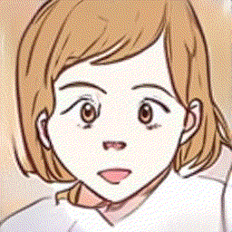
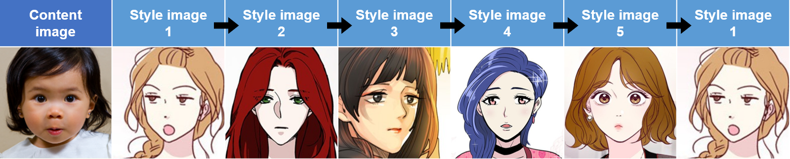
This project is aim to accomplish style transfer from human faces to anime / manga / cartoon styles.


## How to Use
> [!WARNING]
> Please note that this model is based on an earlier framework and the code may not be fully cleaned or optimized. It is intended for educational purposes and may not reflect current coding best practices or the most recent model iterations.

### Train
1. Clone the original [swapping-autoencoder-pytorch](https://github.com/rosinality/swapping-autoencoder-pytorch.git) repo.
2. Overwrite the following Python files using the source code from the `/code` directory:
    - `model.py` → `swapping-autoencoder-pytorch/model.py`
    - `generate.py` → `swapping-autoencoder-pytorch/generate.py`
    - `train_face_model31.py` or `train_face_model42.py` (choose one) → `swapping-autoencoder-pytorch/train.py`
3. The same usage as the original repo.

### Test
You can test the models with the Jupyter Notebooks in the `/ipynb` folder.

### Trained Models
- [model34_010000.pt](https://drive.google.com/file/d/1Obzo-jXk1cGjQPfxHPnIKFjqHxAQ5IvT/view?usp=sharing)
- [model42_150000.pt](https://drive.google.com/file/d/1rI0ra7AMis-gZ36_CkYE-1p0BveoROw7/view?usp=drive_link)


## Virtual Environment Setup (Anaconda)
| <div align="center">Spec</div> |  |
| :--- | :--- |
| **OS** | ubuntu 16.04.5 LTS |
| **GPU** | NVIDIA RTX 2080 * 4 |
| **RAM** | >= 32G |
| **CUDA** | 10.0.130 |
| **Nvidia Driver** | >= 450.80.02 |
| **CuDNN SDK** | 7.6.5 (for cuda10.0) |
| **nccl** | 2.5.6 (for cuda10.0) |
| **Python** | 3.6.12 |
| **tensorlfow** | 1.14.0 |


## Results
### Trained styles
The styles used below are from our training dataset.

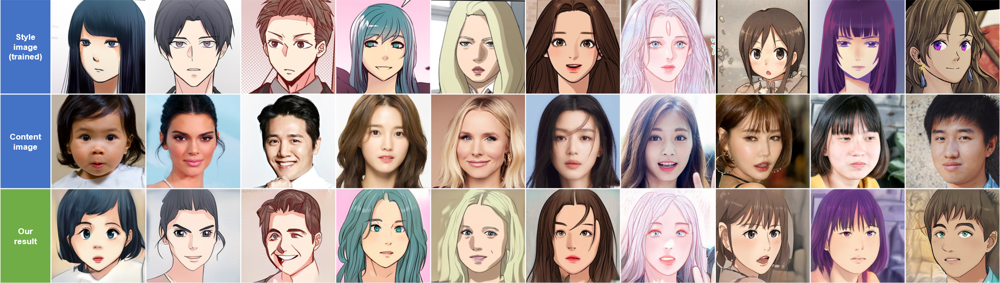


### Un-trained styles
The styles used below are randomly collected from the internet.

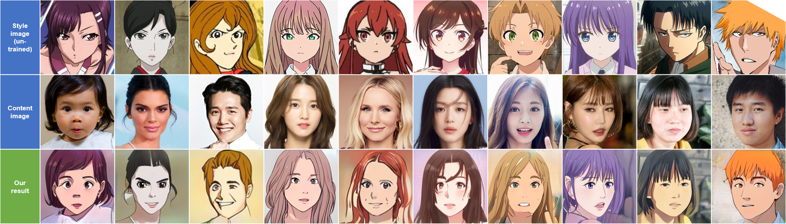


### Mean style transference
`Mean style` denotes the mean of all texture codes of our training styles.

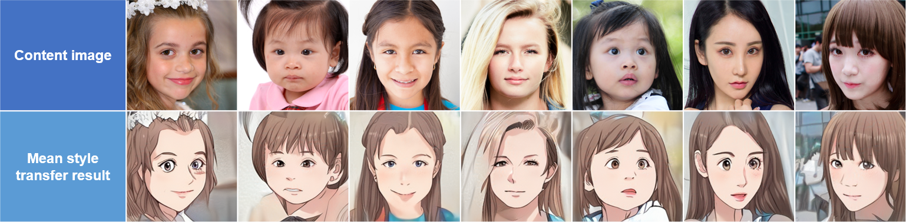


### Texture interpolation
```
Tx rate = n
tx1 : tx2 = 1-n : n
```
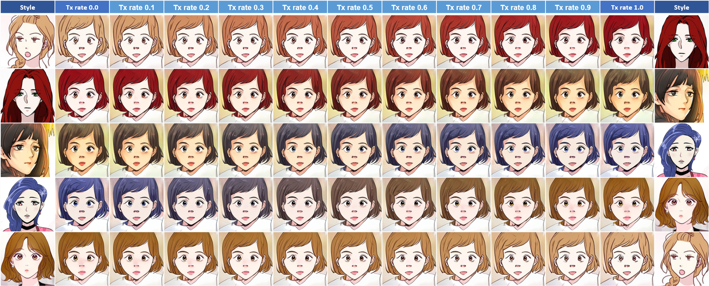


### Structure interpolation
Unfortunately, our model fail to interpolate structures as it can only be applied to texture semantic style transfer.
```
Stu rate = n
stu1 : stu2 = 1-n : n
```
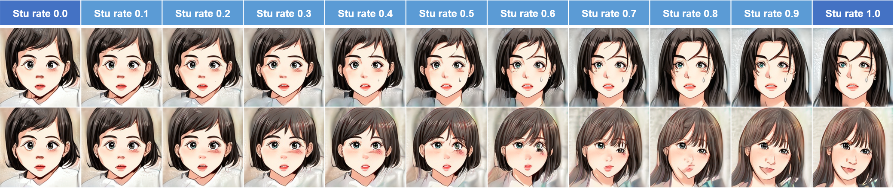

<br />

Results with removing backgrounds using [removebg](https://www.remove.bg/zh).

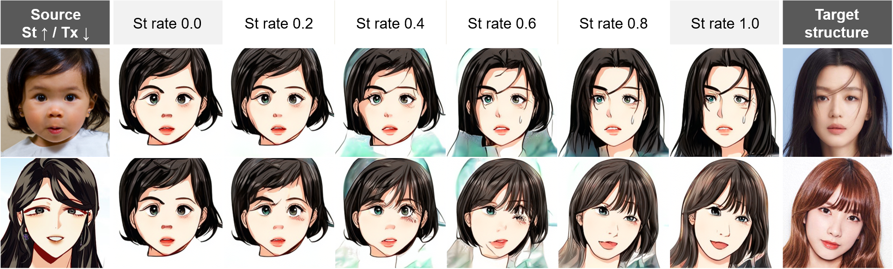


## Comparison
* **Compared methods**
    * U-GAT-IT [[paper]](https://arxiv.org/abs/1907.10830) [[web]](https://selfie2anime.com/) [[github]](https://github.com/taki0112/UGATIT)
    * Artbreeder [[web]](https://www.artbreeder.com/)
    * neural-style-tf [[github]](https://github.com/cysmith/neural-style-tf)
    * deepart io [[web]](https://deepart.io/)
    * Deep Image Analogy [[paper]](https://arxiv.org/abs/1705.01088) [[github]](https://github.com/msracver/Deep-Image-Analogy)
    * FaceBlit [[paper]](https://dcgi.fel.cvut.cz/home/sykorad/Texler21-I3D.pdf) [[github]](https://github.com/AnetaTexler/FaceBlit)
    * Adobe Characterizer [[web]](https://www.adobe.com/products/character-animator.html) [[video]](https://www.youtube.com/watch?v=z02AcZhxSfs)
    * original SwapAE [[paper]](https://arxiv.org/abs/2007.00653) [[github]](https://github.com/taesungp/swapping-autoencoder-pytorch)
    * WCT2 [[paper]](https://arxiv.org/abs/1903.09760) [[github]](https://github.com/clovaai/WCT2)

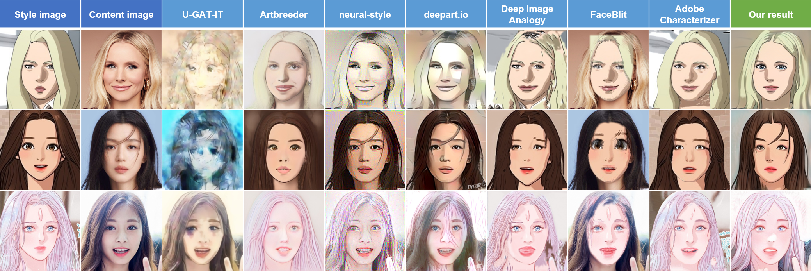


<br />

* **Lighting preservation**

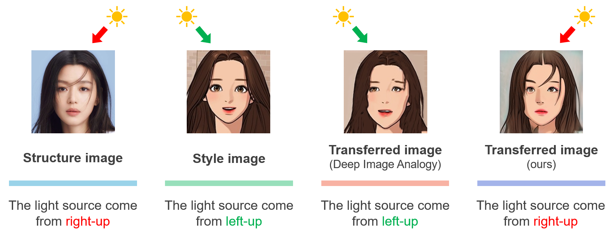

## Further Transformation
### In-Domain GAN Inversion for Real Image Editing
Zhu et al. 2020. [[paper]](https://arxiv.org/abs/2004.00049) [[github]](https://github.com/genforce/idinvert)

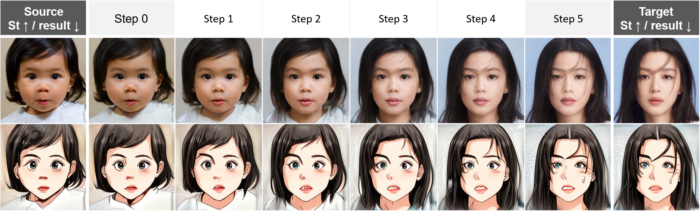

### Toonify!
Justin Pinkney. 2020. [[web]](https://toonify.photos/)

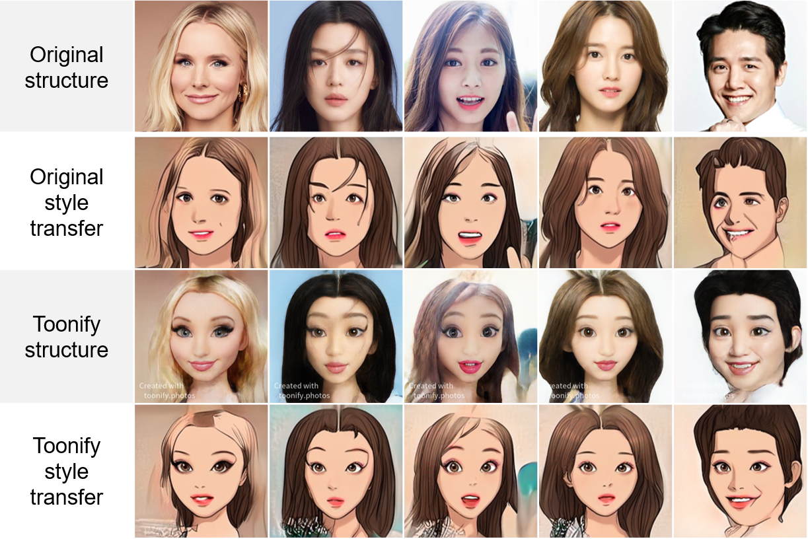

## Datasets
:warning: **Warning:** All images are only used for research purpose. Prohibited for commercial use.

### Training data
* **Anime**
    * Images randomly collected from [WEBTOON](https://www.webtoons.com/zh-hant/). (Total: 22,741; Titles: 128)
    * Images generated from StyleGAN2 anime pre-train [model](https://www.gwern.net/Faces#stylegan-2). (Total: 300)
* **Human faces**
    * Images generated from StyleGAN2 FFHQ pre-train [model](https://github.com/NVlabs/stylegan2). (Total: 3,802)
    * Celebrity faces selected from the [CelebA](https://mmlab.ie.cuhk.edu.hk/projects/CelebA.html) dataset and randomly collected from the internet. (Total: 1,311)

### Testing data
* **Anime**
    * Images randomly collected from the internet. (Total: 170)
* **Human faces**
    * Images randomly collected from the internet. (Total: 17)
    * Images selected from the [FFHQ](https://github.com/NVlabs/ffhq-dataset) dataset. (Total: 63)


## Acknowledgement
* The related research papers:
    * _Swapping Autoencoder for Deep Image Manipulation_ [[paper]](https://arxiv.org/abs/2007.00653) [[github]](https://github.com/taesungp/swapping-autoencoder-pytorch)
    * _Learning to Cartoonize Using White-box Cartoon Representations_ [[paper]](https://github.com/SystemErrorWang/White-box-Cartoonization/blob/master/paper/06791.pdf) [[github]](https://github.com/SystemErrorWang/White-box-Cartoonization)
* Face cartoonization for pre-processing [here](https://github.com/SystemErrorWang/FacialCartoonization).
* The idea of this project is highly inspired from [naver-webtoon-faces](https://github.com/bryandlee/naver-webtoon-faces) by bryandlee.
* Our code implementation is based on [swapping-autoencoder-pytorch](https://github.com/rosinality/swapping-autoencoder-pytorch) by rosinality.


## BibTeX Citation
If you find this work useful for your research, please cite:
* [NDLTD in Taiwan](https://hdl.handle.net/11296/j8jm9n)
* [NTUST ETD](http://etheses.lib.ntust.edu.tw/cgi-bin/gs32/gsweb.cgi?o=dstdcdr&s=id=%22G0M10815032%22.&searchmode=basic)

\< English version \>
```
@mastersthesis{huang2021cartoon,
  author={Cheryl Huang},
  title={Cartoon Style Transfer in Faces using Generative Adversarial Networks},
  school={National Taiwan University of Science and Technology},
  year={2021},
  note={\url{https://hdl.handle.net/11296/j8jm9n}}
}
```

\< Chinese version \>
```
@mastersthesis{huang2021cartoon,
  author={黃竹萱},
  title={基於生成對抗網路之臉部卡通風格轉換},
  school={國立臺灣科技大學資訊工程研究所},
  year={2021},
  note={\url{https://hdl.handle.net/11296/j8jm9n}}
}
```


## License

[](https://www.ntust.edu.tw/home.php)  [](http://gamelab.csie.ntust.edu.tw/)

Copyright &copy; 2021 Cheryl Huang. All rights reserved.