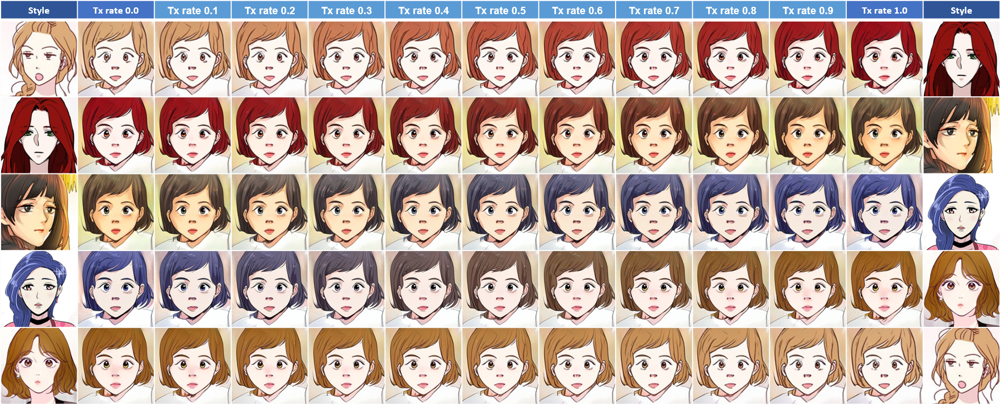

# Faces2Anime


This project is aim to accomplish style transfer from human faces to anime / menga / cartoon styles.

:warning: **Note:** This research project is still on going. Sorry but the source code is not available for now.


## Results
### Trained styles
The styles used below are from our training dataset.


### Un-trained styles
The styles used below are randomly collected from the internet.


### Mean style transference
`Mean style` denotes the mean of all texture codes of our training styles.


### Texture interpolation
```
Tx rate = n
tx1 : tx2 = 1-n : n
```



### Structure interpolation
Unfortunately, the success rate of interpolating structures is highly related to the similarity of facial features. The interpolation could easily fail as the diversity of features increased.
```
Stu rate = n
stu1 : stu2 = 1-n : n
```


## Comparison
* **Compared methods**
    * U-GAT-IT [[paper]](https://arxiv.org/abs/1907.10830) [[web]](https://selfie2anime.com/) [[github]](https://github.com/taki0112/UGATIT)
    * Artbreeder [[web]](https://www.artbreeder.com/)
    * neural-style-tf [[github]](https://github.com/cysmith/neural-style-tf)
    * deepart io [[web]](https://deepart.io/)
    * Deep Image Analogy [[paper]](https://arxiv.org/abs/1705.01088) [[github]](https://github.com/msracver/Deep-Image-Analogy)
    * FaceBlit [[paper]](https://dcgi.fel.cvut.cz/home/sykorad/Texler21-I3D.pdf) [[github]](https://github.com/AnetaTexler/FaceBlit)
    * Adobe Characterizer [[web]](https://www.adobe.com/products/character-animator.html) [[video]](https://www.youtube.com/watch?v=z02AcZhxSfs)
    * original SwapAE [[paper]](https://arxiv.org/abs/2007.00653) [[github]](https://github.com/taesungp/swapping-autoencoder-pytorch)
    * WCT2 [[paper]](https://arxiv.org/abs/1903.09760) [[github]](https://github.com/clovaai/WCT2)


## Datasets
### Training data
* **Anime**
    * Images randomly collected from [WEBTOON](https://www.webtoons.com/zh-hant/). (Total: 22,741; Titles: 128)
    * Images generated from StyleGAN2 anime pre-train [model](https://www.gwern.net/Faces#stylegan-2). (Total: 300)
* **Human faces**
    * Images generated from StyleGAN2 FFHQ pre-train [model](https://github.com/NVlabs/stylegan2). (Total: 3,802)
    * Celebrity faces selected from the [CelebA](https://mmlab.ie.cuhk.edu.hk/projects/CelebA.html) dataset and randomly collected from the internet. (Total: 1,311)

### Testing data
* **Anime**
    * Images randomly collected from the internet. (Total: 170)
* **Human faces**
    * Images randomly collected from the internet. (Total: 17)
    * Images selected from the [FFHQ](https://github.com/NVlabs/ffhq-dataset) dataset. (Total: 63)


## Acknowledgement
* The original research papers:
    * Swapping Autoencoder for Deep Image Manipulation [[paper]](https://arxiv.org/abs/2007.00653) [[github]](https://github.com/taesungp/swapping-autoencoder-pytorch)
    * Learning to Cartoonize Using White-box Cartoon Representations [[paper]](https://github.com/SystemErrorWang/White-box-Cartoonization/blob/master/paper/06791.pdf) [[github]](https://github.com/SystemErrorWang/White-box-Cartoonization)
* Face cartoonization for pre-processing [here](https://github.com/SystemErrorWang/FacialCartoonization).
* The idea of this project is highly inspired from [naver-webtoon-faces](https://github.com/bryandlee/naver-webtoon-faces) by bryandlee.
* Our code implementation is based on [swapping-autoencoder-pytorch](https://github.com/rosinality/swapping-autoencoder-pytorch) by rosinality.


## License

[](https://www.ntust.edu.tw/home.php)  [](http://gamelab.csie.ntust.edu.tw/)
Copyright &copy; 2021 Cheryl Huang. All rights reserved.